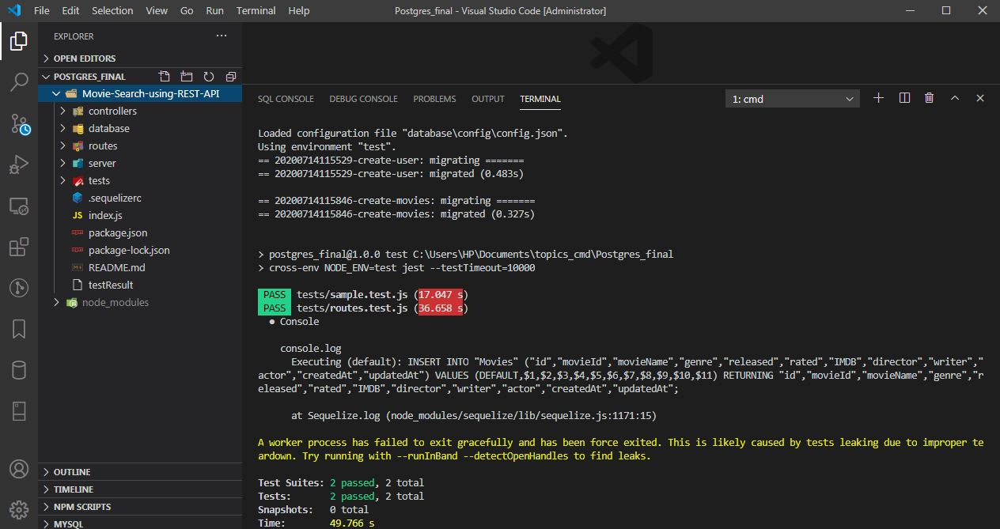

# Movie-Search-using-PostgreSQL & Sequelize
In this project, I have used postgreSQL with sequelize , Node.js, Express and jest and supertest testing framework

https://dev.to/nedsoft/getting-started-with-sequelize-and-postgres-emp    - This webiste for creating CRUD operation with postgreSQL, express, Node.js

https://www.djamware.com/post/5bb1f05280aca74669894417/node-express-sequelize-and-postgresql-association-example - Best website for creating new postgres Database

# JEST testing

